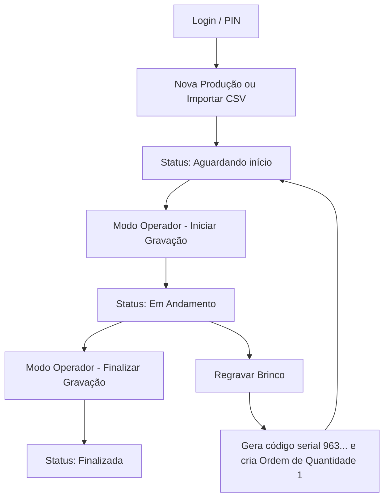

# Documentação Técnica e Manual do Usuário - ControlMachine v1.2

Esta documentação detalha o conceito, arquitetura, fluxo de funcionamento e guias de utilização do **ControlMachine** — Sistema de Controle de Produção para Máquinas Laser.

---

## 1. Conceito do Sistema

O **ControlMachine** é um sistema industrial de gerenciamento de ordens de produção projetado para o chão de fábrica de gravação a laser. Ele atua como uma interface unificada para operadores e supervisores, conectando o fluxo físico de peças ao gerenciamento lógico de dados.

### Arquitetura de Resiliência Offline (Híbrida)
O maior diferencial do sistema é sua capacidade de continuar operando normalmente no chão de fábrica mesmo em caso de queda total de rede ou indisponibilidade do servidor central MySQL.
* **Banco Local (SQLite):** Todas as telas da aplicação interagem diretamente com um banco de dados local leve em SQLite (`localdb.sqlite`). Isso garante que a interface responda instantaneamente e que novos registros possam ser inseridos sem latência de rede.
* **Banco Remoto (MySQL):** O servidor central centraliza as produções de todas as máquinas laser e o cadastro corporativo de usuários.
* **Serviço de Sincronismo (SyncService):** Um serviço executado em segundo plano monitora a rede. A cada 30 segundos, ele detecta de forma transparente se o banco MySQL está ativo. Se estiver, ele realiza a sincronização bidirecional:
  * **Upload:** Envia novos registros de produção, re-gravações e logs de auditoria gerados localmente (`Sincronizado = 0`).
  * **Download:** Baixa novos usuários cadastrados, alterações de permissões e fichas técnicas criadas por administradores em outros terminais.

---

## 2. Fluxo de Funcionamento

O ciclo de vida das informações dentro do sistema segue um processo lógico e linear:



### Regras de Negócio Importantes:
1. **Regravações de Brinco:** Quando uma gravação falha (por erro de foco, peça defeituosa, etc.), o operador master pode disparar a **Regravação**. O sistema solicita o motivo da falha, gera um serial único de 15 dígitos começado com o prefixo `963` e insere uma nova ordem de produção vinculada com a quantidade `1` e sufixo `-R` no pedido original (ex: `OS-100-R`).
2. **Rastreabilidade e Auditoria:** Cada mudança de status, login ou alteração de dados gera automaticamente um registro na tabela de **Auditoria**, identificando a hora exata, o usuário responsável e o detalhe da ação.
3. **Níveis de Acesso (Master vs. Comum):**
   * **Usuário Master (Administrador):** Tem acesso total às configurações de parâmetros, cadastro de máquinas laser, gerenciamento/reset de senhas de outros usuários, visualização de gráficos de produtividade (Dashboard), transferências de produção entre máquinas e exclusão lógica.
   * **Usuário Comum (Operador):** Visualiza apenas pedidos pendentes ou em andamento (as ordens "Finalizadas" são ocultadas para simplificar o trabalho). Ele só consegue editar seu próprio usuário (alterar senha e PIN) e não pode visualizar relatórios gerenciais ou cadastros de sistema.

---

## 3. Manual de Utilização (Como Usar)

### 3.1 Login e Acesso Rápido
1. Ao iniciar a aplicação, após a tela de Splash com o logo e imagem do robô, a tela de login é exibida.
2. **Login Convencional:** Digite o nome de usuário (ex: `admin`) e senha (ex: `123`) e clique em "Entrar".
3. **Login Rápido (PIN / Crachá):** Para operadores no chão de fábrica, basta posicionar o cursor no campo "Acesso Rápido (Crachá / PIN)", bipar o código do crachá com o leitor de código de barras (ou digitar o PIN) e pressionar **Enter**. O login é realizado instantaneamente.

### 3.2 Gerenciando Ordens de Produção
* **Cadastrar Manualmente:** Clique em **"Nova Prod."**, preencha o número do Pedido, Cliente, Quantidade de peças, escolha qual Máquina executará o trabalho e selecione a **Ficha Técnica** (receita de potência/velocidade do laser).
* **Modo Operador (Tela Cheia):** Selecione o pedido desejado no grid e clique em **"Modo Operador"** (ou dê um duplo clique na linha). A tela exibe os dados em fontes grandes para facilitar a leitura no ambiente de fábrica.
  * Clique em **"Iniciar Gravação"** para mudar o status para *Em Andamento*.
  * Clique em **"Finalizar Gravação"** ao concluir para mudar o status para *Finalizada*.
  * Se a peça for perdida, clique em **"Regravar Brinco"** (disponível apenas para supervisores Master).
* **Pesquisa e Filtros:** Use os campos do topo para filtrar as ordens de produção. Você pode pesquisar digitando nos filtros e pressionando **Enter** para buscar imediatamente. Se quiser buscar por período, marque o checkbox "Filtrar Data".
* **Leitor de Código de Barras (OS):** Você pode bipar a folha de ordens de serviço no campo **"Leitor/OS"** no topo da tela principal. O sistema localiza o registro e abre automaticamente a tela do Modo Operador.

### 3.3 Importação e Exportação de Dados
* **Exportar Relatórios:** Na tela principal, clique em **"Exportar"**. O sistema gerará de forma automática três arquivos na pasta `C:\temp\`:
  1. `ProducoesExportadas.xml` (formato estruturado de integração)
  2. `ProducoesExportadas.ods` (formato nativo do LibreOffice Calc)
  3. `ProducoesExportadas.xlsx` (planilha do Microsoft Excel)
* **Importação em Lote (CSV):** Através do menu **"Importação"** (restrito a usuários Master), selecione o tipo de arquivo que deseja importar. O sistema guiará a seleção do arquivo e exibirá o relatório detalhado do resultado.

---

## 4. Estrutura de Arquivos CSV para Importação

Para que a importação funcione corretamente, os cabeçalhos das planilhas CSV devem conter os nomes especificados abaixo (o sistema aceita delimitadores por vírgula `,` ou ponto e vírgula `;`):

### 4.1 Importar Brincos (Histórico de Gravações)
* **Cabeçalhos Suportados:** `Numero` (ou `brinco`/`serial`), `DataGravacao` (opcional), `MaquinaId` (opcional), `MotivoRegravacao` (opcional).
* **Exemplo de Conteúdo:**
  ```csv
  Numero;DataGravacao;MaquinaId;MotivoRegravacao
  963000000000101;2026-05-28 14:00:00;1;
  963000000000102;2026-05-28 14:15:00;1;Erro de Foco
  ```

### 4.2 Importar Pedidos (Ordens de Produção)
* **Cabeçalhos Suportados:** `Pedido`, `Cliente`, `NumeroProducao` (ou `numero`), `Status` (opcional), `Quantidade` (opcional), `DataProducao` (opcional), `MaquinaId` (opcional), `FichaTecnicaId` (opcional).
* **Exemplo de Conteúdo:**
  ```csv
  Pedido;Cliente;NumeroProducao;Status;Quantidade;DataProducao;MaquinaId;FichaTecnicaId
  OS-2026-901;Acme Corporation;963000000000201;Aguardando;15;2026-05-28 10:00:00;1;1
  OS-2026-902;Metalúrgica Silva;963000000000202;Em Andamento;30;2026-05-28 10:30:00;1;2
  ```

### 4.3 Importar Usuários em Massa
* **Cabeçalhos Suportados:** `Nome`, `Login`, `CodigoAcesso` (PIN/Crachá), `NivelMaster` (0 ou 1), `Ativo` (0 ou 1).
* **Exemplo de Conteúdo:**
  ```csv
  Nome;Login;CodigoAcesso;NivelMaster;Ativo
  Operador João;joao;7777;0;1
  Supervisora Maria;maria;8888;1;1
  ```
  *(Nota: O sistema solicitará uma senha padrão que será definida e criptografada em hash para todos os usuários importados de uma só vez).*

---

## 5. Documentação de Telas do Sistema

### 5.1 Tela de Splash (Abertura)
* **Função:** Tela de apresentação exibida por alguns segundos durante o carregamento inicial da aplicação.
* **Componentes:** Exibe a imagem ilustrativa do robô industrial (`docs\robô.png`), o título do sistema **ControlMachine** e o subtítulo **SISTEMA DE PRODUÇÃO LASER** sobre um fundo moderno escuro.

### 5.2 Tela de Login (`FrmLogin.cs`)
* **Função:** Garante a segurança e identifica qual usuário e nível de acesso operará o terminal.
* **Componentes:**
  * Campos tradicionais de Usuário e Senha.
  * Botões "Entrar" e "Sair".
  * Seção dedicada de **"Acesso Rápido"** para autenticação instantânea por PIN ou leitura de código de barras do crachá.

### 5.3 Tela Principal (`FrmPrincipal.cs`)
* **Função:** Painel geral de controle, monitoramento e pesquisa de produções.
* **Componentes:**
  * **Menu Superior (MenuStrip):** Dá acesso às configurações do sistema (cadastro de usuários, máquinas, receitas de gravação, auditorias, dashboard, importação e o menu de ajuda).
  * **Painel de Filtros:** Contém campos para filtrar a listagem em tempo real (Pedido, Cliente, Nº Produção, Status, Usuário e Período de data).
  * **Campo Leitor/OS:** Focado para receber leituras diretas de códigos de barra para abrir ordens de serviço instantaneamente.
  * **Grid Central de Dados:** Mostra as ordens de produção cadastradas com seus respectivos dados e o status de sincronização (Sync?) com o servidor MySQL.

### 5.4 Tela do Modo Operador (`FrmModoOperador.cs`)
* **Função:** Tela em formato simplificado e de alto contraste projetada para telas touch ou visualização rápida à distância.
* **Componentes:**
  * Card com dados do Pedido e Cliente com fontes ampliadas.
  * Painel com os parâmetros da **Ficha Técnica** selecionada (Potência, Velocidade, Frequência e Passadas) em destaque.
  * Botões de comando grandes e coloridos: **Iniciar Gravação** (Verde), **Finalizar Gravação** (Azul) e **Regravar Brinco** (Vermelho - exclusivo para Master).

### 5.5 Gestão de Usuários (`FrmUsuarios.cs`)
* **Função:** Inclusão, alteração, controle de PIN/Crachá e bloqueio de usuários.
* **Componentes:**
  * Campos para Nome, Login, Senha, PIN.
  * Checkboxes de Nível Master e Ativo (com edição bloqueada para operadores comuns).
  * Botões "Salvar", "Limpar", "Trocar Senha" e **"Resetar Senha"** (que permite definir a senha padrão `'123'`).

### 5.6 Fichas Técnicas / Parâmetros do Laser (`FrmFichasTecnicas.cs`)
* **Função:** Cadastro de receitas de potência e velocidade para padronizar as gravações do laser.
* **Componentes:**
  * Cadastro dos valores de Potência (%), Velocidade (mm/s), Frequência (kHz) e Passadas.
  * Permite ativar ou inativar receitas específicas.

### 5.7 Painel de Dashboard e Indicadores (`FrmDashboard.cs`)
* **Função:** Exibe representações visuais rápidas do andamento da fábrica.
* **Componentes:**
  * Três gráficos de barras renderizados dinamicamente:
    1. **Status:** Divisão de ordens em Aguardando, Em Andamento e Finalizadas.
    2. **Usuários:** Produtividade e total de ordens executadas por operador.
    3. **Motivos de Regravação:** Quantidade de peças refeitas agrupadas pelo tipo de falha (Erro de foco, Laser, Peça defeituosa, etc.).


---

## 6. Modelagem e Estrutura do Banco de Dados

O sistema **ControlMachine** utiliza um modelo de banco de dados híbrido composto por uma instância local em **SQLite** (para resiliência e operação offline no chão de fábrica) e uma instância corporativa em **MySQL** (como repositório unificado centralizado).

### 6.1 Detalhes Técnicos e Tipos de Dados

| Elemento | Banco Local (SQLite) | Banco Remoto (MySQL) |
| :--- | :--- | :--- |
| **Tecnologia** | SQLite v3 | MySQL v8 ou compatível |
| **Localização** | Arquivo `localdb.sqlite` na pasta da aplicação | Servidor IP corporativo configurado em `DatabaseHelper.cs` |
| **Geração de IDs** | Auto-incremento / Chaves inteiras locais | Auto-incremento centralizado `AUTO_INCREMENT` |
| **Tipos Textuais** | `TEXT` | `VARCHAR` com limites específicos |
| **Tipos de Data** | `TEXT` no formato ISO `yyyy-MM-dd HH:mm:ss` | `DATETIME` nativo |
| **Tipos Booleanos** | `INTEGER` (0 = Falso, 1 = Verdadeiro) | `BOOLEAN` / `TINYINT(1)` |

---

### 6.2 Dicionário de Tabelas e Mapeamento de Colunas

#### 6.2.1 Tabela `Usuarios`
Armazena as credenciais, níveis de acesso e códigos PIN de crachá de login.

| Coluna | Tipo SQLite | Tipo MySQL | Constraints / Índice | Descrição |
| :--- | :--- | :--- | :--- | :--- |
| **Id** | `INTEGER` | `INT` | Primary Key | Identificador único do usuário. |
| **Nome** | `TEXT` | `VARCHAR(100)` | NOT NULL | Nome completo do usuário. |
| **Login** | `TEXT` | `VARCHAR(50)` | UNIQUE, NOT NULL | Nome de usuário único para login. |
| **SenhaHash** | `TEXT` | `VARCHAR(255)` | NOT NULL | Senha criptografada (hash SHA-256). |
| **CodigoAcesso**| `TEXT` | `VARCHAR(50)` | UNIQUE, NULL | PIN numérico ou código de barras do crachá para login rápido. |
| **NivelMaster** | `INTEGER` | `BOOLEAN` | Default 0 | Define privilégios (0 = Comum/Operador, 1 = Master/Supervisor). |
| **Ativo** | `INTEGER` | `BOOLEAN` | Default 1 | Status do usuário (0 = Inativo/Bloqueado, 1 = Ativo). |

#### 6.2.2 Tabela `Parametros`
Configurações globais e variáveis de comportamento do sistema.

| Coluna | Tipo SQLite | Tipo MySQL | Constraints | Descrição |
| :--- | :--- | :--- | :--- | :--- |
| **Id** | `INTEGER` | `INT` | Primary Key | Identificador numérico do parâmetro. |
| **Chave** | `TEXT` | `VARCHAR(50)` | UNIQUE, NOT NULL | Identificador textual único da regra (ex: "tempo_refrescar"). |
| **Valor** | `TEXT` | `VARCHAR(255)` | NOT NULL | Valor configurado para a chave de parâmetro. |
| **Descricao** | `TEXT` | `TEXT` | NULL | Explicação amigável da função do parâmetro. |

#### 6.2.3 Tabela `MaquinasLaser`
Cadastro das gravadoras laser ativas no chão de fábrica.

| Coluna | Tipo SQLite | Tipo MySQL | Constraints | Descrição |
| :--- | :--- | :--- | :--- | :--- |
| **Id** | `INTEGER` | `INT` | Primary Key | Identificador numérico da máquina laser. |
| **Nome** | `TEXT` | `VARCHAR(100)` | NOT NULL | Nome amigável da máquina (ex: "Laser Fibra 01"). |
| **Descricao** | `TEXT` | `TEXT` | NULL | Especificações técnicas do equipamento. |
| **Ativa** | `INTEGER` | `BOOLEAN` | Default 1 | Define se a máquina está disponível para seleção (0 = Não, 1 = Sim). |

#### 6.2.4 Tabela `FichasTecnicas`
Receitas de gravação que padronizam potência, velocidade e passadas de gravação por tipo de peça.

| Coluna | Tipo SQLite | Tipo MySQL | Constraints | Descrição |
| :--- | :--- | :--- | :--- | :--- |
| **Id** | `INTEGER` | `INT` | Primary Key | Identificador numérico da ficha técnica. |
| **Nome** | `TEXT` | `VARCHAR(100)` | NOT NULL | Nome da receita (ex: "Gravação Ouro 18k"). |
| **Potencia** | `REAL` | `DOUBLE` | NOT NULL | Potência do laser (em porcentagem: 0.0% a 100.0%). |
| **Velocidade** | `INTEGER` | `INT` | NOT NULL | Velocidade de varredura do laser em mm/s. |
| **Frequencia** | `INTEGER` | `INT` | NOT NULL | Frequência em kHz. |
| **Passadas** | `INTEGER` | `INT` | NOT NULL | Quantidade de repetições da gravação (passadas do feixe). |
| **Ativa** | `INTEGER` | `BOOLEAN` | Default 1 | Define se a receita está ativa para uso (0 = Inativa, 1 = Ativa). |

#### 6.2.5 Tabela `Brincos`
Cadastro físico de brincos gravados ou solicitados para regravação.

| Coluna | Tipo SQLite | Tipo MySQL | Constraints / FK | Descrição |
| :--- | :--- | :--- | :--- | :--- |
| **Id** | `INTEGER` | `INT` | Primary Key | Identificador do registro de brinco. |
| **Numero** | `TEXT` | `VARCHAR(15)` | UNIQUE, NOT NULL | Código único de 15 dígitos gerado pelo sistema (prefixo `963`). |
| **DataGravacao**| `TEXT` | `DATETIME` | NOT NULL | Data e hora exata em que o brinco foi gerado/gravado. |
| **MaquinaId** | `INTEGER` | `INT` | FK -> MaquinasLaser | Máquina laser utilizada na gravação. |
| **MotivoRegravacao**| `TEXT` | `VARCHAR(255)` | NULL | Motivo informado se o brinco foi re-gravado (ex: "Erro do Operador"). |
| **Sincronizado**| `INTEGER` | -- *(N/A)* | SQLite Only | Controle de replicação de dados (0 = pendente, 1 = enviado). |

#### 6.2.6 Tabela `Producoes`
Entidade central contendo ordens de serviço, pedidos, clientes e quantidade de gravação.

| Coluna | Tipo SQLite | Tipo MySQL | Constraints / FK | Descrição |
| :--- | :--- | :--- | :--- | :--- |
| **Id** | `INTEGER` | `INT` | Primary Key | ID do registro (em SQLite é gerado localmente, em MySQL auto-incremento). |
| **RemoteId** | `INTEGER` | -- *(N/A)* | SQLite Only, NULL | Guarda o ID primário do MySQL correspondente a essa produção local. |
| **Pedido** | `TEXT` | `VARCHAR(50)` | NOT NULL | Código da Ordem de Serviço ou pedido (ex: "OS-500"). |
| **Cliente** | `TEXT` | `VARCHAR(100)` | NOT NULL | Nome do cliente dono do lote de brincos. |
| **NumeroProducao**| `TEXT` | `VARCHAR(50)` | NOT NULL | Número de controle da produção vinculada. |
| **Status** | `TEXT` | `VARCHAR(30)` | NOT NULL | Situação da produção: `'Aguardando'`, `'Em Andamento'` ou `'Finalizada'`. |
| **Quantidade** | `INTEGER` | `INT` | NOT NULL | Quantidade de brincos/peças no lote. |
| **DataProducao**| `TEXT` | `DATETIME` | NOT NULL | Data e hora de criação do lote de produção. |
| **UsuarioId** | `INTEGER` | `INT` | FK -> Usuarios | Usuário operador responsável pelo processamento. |
| **MaquinaId** | `INTEGER` | `INT` | FK -> MaquinasLaser | Máquina laser em que a produção foi alocada. |
| **FichaTecnicaId**| `INTEGER` | `INT` | FK -> FichasTecnicas | Ficha técnica (receita de laser) utilizada (pode ser NULL). |
| **Sincronizado**| `INTEGER` | -- *(N/A)* | SQLite Only | Sinalizador do estado de sincronização (0 = local pendente, 1 = sincronizado). |

#### 6.2.7 Tabela `Auditoria`
Registros de rastreabilidade contendo histórico de ações de todos os usuários.

| Coluna | Tipo SQLite | Tipo MySQL | Constraints / FK | Descrição |
| :--- | :--- | :--- | :--- | :--- |
| **Id** | `INTEGER` | `INT` | Primary Key | Identificador único do log de auditoria. |
| **DataHora** | `TEXT` | `DATETIME` | NOT NULL | Data e hora exata em que o evento ocorreu. |
| **UsuarioId** | `INTEGER` | `INT` | FK -> Usuarios | Usuário que realizou a ação. |
| **Acao** | `TEXT` | `VARCHAR(100)` | NOT NULL | Categoria da ação (ex: `"Login"`, `"Regravar Brinco"`, `"Exportar"`). |
| **Detalhes** | `TEXT` | `TEXT` | NULL | Descrição detalhada contendo IDs afetados, valores antigos e novos. |
| **Sincronizado**| `INTEGER` | -- *(N/A)* | SQLite Only | Identifica se o log já foi enviado para a base MySQL central (0=Não, 1=Sim). |

---

### 6.3 Mecanismo de Sincronismo de Dados

Para viabilizar a consistência, a sincronização é mapeada a partir de duas colunas especiais presentes apenas na tabela SQLite local:
1. **`Sincronizado` (0 ou 1):** Quando a máquina realiza qualquer ação local (cria ordem, grava brinco, altera status, cria auditoria), essa coluna é marcada como `0`. O `SyncService` localiza todas as linhas de todas as tabelas onde `Sincronizado = 0` e faz o envio de dados via comandos `INSERT` ou `UPDATE` no MySQL. Ao receber confirmação do MySQL, a linha local é atualizada para `Sincronizado = 1`.
2. **`RemoteId`:** Como o MySQL gera chaves primárias (`AUTO_INCREMENT`), quando um registro de produção local (`Sincronizado = 0`) é inserido no MySQL, a query retorna o ID gerado pelo servidor remoto (via `SELECT LAST_INSERT_ID()`). O sistema então salva esse valor na coluna `RemoteId` do banco SQLite local. Isso garante que atualizações futuras desse lote (como mudança de status para "Finalizada") sejam aplicadas na linha correta do servidor central.

---

## 7. Guia de Instalação e Implantação (Visual Studio)

Este guia orienta passo a passo como configurar e rodar o projeto **ControlMachine** em uma nova máquina de desenvolvimento utilizando o Visual Studio.

### 7.1 Pré-requisitos
Antes de abrir o projeto, certifique-se de que os seguintes softwares estão instalados na máquina destino:
1. **Visual Studio 2022** (qualquer edição: Community, Professional ou Enterprise).
   * *Carga de trabalho obrigatória:* Durante a instalação, marque a opção **"Desenvolvimento para desktop com .NET"** (para obter suporte a Windows Forms).
2. **.NET Framework 4.8 Developer Pack** (se não estiver incluso no Visual Studio, baixe do site oficial da Microsoft).
3. **Servidor MySQL v8.0** ou superior (pode ser local na nova máquina ou um servidor existente acessível na rede).

---

### 7.2 Configuração do Banco de Dados

#### 7.2.1 Preparação do MySQL Remoto/Central
1. Instale o MySQL Server na nova máquina (caso deseje que ela seja o servidor central) ou garanta que possui os dados de rede do servidor existente.
2. Abra um cliente MySQL de sua preferência (ex: MySQL Workbench, DBeaver, HeidiSQL, ou phpMyAdmin).
3. Execute o script contido no arquivo [mysql_script.sql](file:///c:/01Job/ControlMachine/mysql_script.sql) (localizado na pasta raiz do projeto). Esse script cria o schema `controlmachine`, todas as tabelas originais e realiza a inserção dos dados padrão (usuário `admin`, máquinas iniciais e fichas técnicas base).

#### 7.2.2 Configuração da Connection String no C#
1. Abra o arquivo [DatabaseHelper.cs](file:///c:/01Job/ControlMachine/Data/DatabaseHelper.cs).
2. Localize a linha contendo a variável `MySqlConnectionString` (próxima à linha 12):
   ```csharp
   public static string MySqlConnectionString = "Server=localhost;Database=controlmachine;Uid=root;Pwd=segredo@64;";
   ```
3. Altere as credenciais conforme as configurações da nova máquina:
   * **Server:** Altere de `localhost` para o IP do servidor remoto (ou mantenha `localhost` se o MySQL estiver rodando na mesma máquina).
   * **Uid:** Nome do usuário de acesso ao MySQL (ex: `root`).
   * **Pwd:** Senha de acesso definida no servidor de banco de dados.

#### 7.2.3 Banco Local SQLite (Autogerido)
Não há necessidade de qualquer configuração manual para o banco SQLite:
* Ao iniciar a aplicação pela primeira vez, o código em `Program.cs` disparará automaticamente o método `DatabaseHelper.InitializeLocalDatabase()`.
* O arquivo de banco de dados `localdb.sqlite` será criado automaticamente na pasta de execução do binário (ex: `bin\Debug\net48\`) e estruturado com todas as tabelas e migrações necessárias.

---

### 7.3 Abrindo e Restaurando o Projeto no Visual Studio

1. Copie a pasta do projeto `ControlMachine` completa para o disco rígido da nova máquina.
2. Abra o **Visual Studio**.
3. Clique em **"Abrir um projeto ou solução"** e selecione o arquivo [ControlMachine.csproj](file:///c:/01Job/ControlMachine/ControlMachine.csproj).
4. O Visual Studio abrirá o projeto e criará um arquivo de solução `.sln` temporário ou definitivo.
5. **Restaurar Pacotes NuGet:** O projeto utiliza pacotes externos gerenciados pelo NuGet (`MySqlConnector`, `System.Data.SQLite.Core`, `Dapper` e `ClosedXML`). 
   * Normalmente, o Visual Studio baixa e restaura esses pacotes de forma automática ao clicar em **Compilar**.
   * Se os pacotes apresentarem erros de referência (triângulo amarelo), clique com o botão direito na Solução e selecione **"Restaurar Pacotes NuGet"**.

---

### 7.4 Diretórios e Permissões do Sistema

Garante que a nova máquina possua:
1. **Pasta de Exportações:** A função de exportar gera relatórios em `C:\temp\`. O usuário logado no Windows deve possuir permissão para ler e escrever no diretório `C:\` para que a pasta `temp` possa ser criada automaticamente.
2. **Docs e Splash:** Certifique-se de que a pasta `docs` contendo a imagem `robô.png` está no caminho `c:\01Job\ControlMachine\docs\robô.png` (ou ajuste o caminho em `Program.cs` se mudar o projeto de pasta). O sistema converte esse arquivo para `.ico` em tempo de execução para definir o ícone da aplicação.

---

### 7.5 Execução e Primeiro Acesso

1. No topo do Visual Studio, configure o modo de build para **Debug** (ou **Release**) e plataforma para **Any CPU** ou **x86/x64**.
2. Pressione **F5** (ou clique no botão **Iniciar / Start**).
3. O sistema exibirá a tela de Splash e em seguida a tela de login.
4. **Dados de Acesso Padrão:**
   * **Usuário:** `admin`
   * **Senha:** `123`
5. Uma vez conectado como master, você poderá gerenciar as demais funções, realizar importações de testes ou cadastrar novos operadores.
